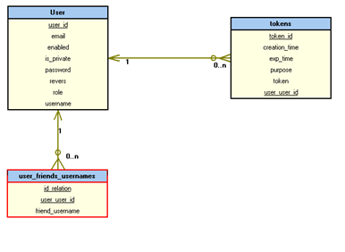
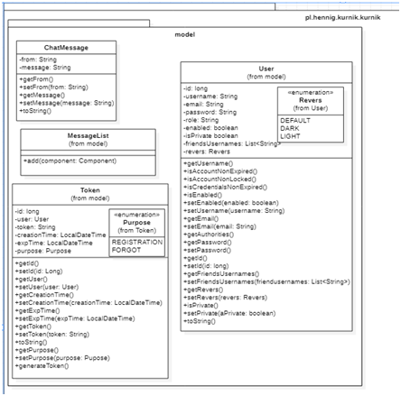
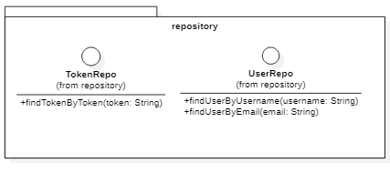
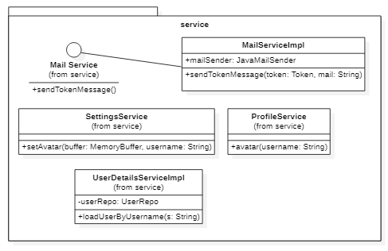
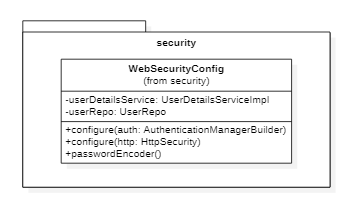
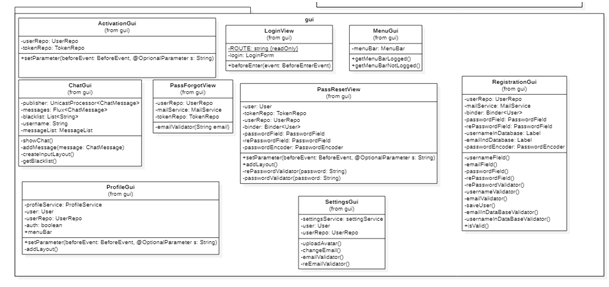

#Kurnik Dla Biednych Ludzi
##1.	Opis Aplikacji

Poniższa aplikacja - Kurnik Dla Biednych Ludzi jest stworzona celem ułatwienia komunikacji pomiędzy użytkownikami. Zawarte w niej moduły poza głównym zastosowaniem, skupiają się wokół konta użytkownika.  Moduły możemy podzielić na te, które nie wymagają, aby użytkownik był zalogowany tj.:
- Rejestracja
- Weryfikacja adresu email
- Logowanie
- Funkcja „zapomniałem hasło”

Oraz moduły które wymagają poprawnie uwierzytelnionego użytkownika:
- Czat
- Ustawienia konta
- Wyszukiwanie konta
- Znajdź użytkownika

Moduł znajdź użytkownika, przeszukuje bazę pod kątem nazwy użytkownika. Po znalezieniu użytkownika wyświetlany jest jego awatar, nazwa użytkownika oraz adres email. Użytkownik  znaleziony, który nie posiada ustawionego awatara, przy wyświetlaniu wykorzystuje API , skąd przypisywany jest losowy awatar. 
W module ustawień konta mamy możliwość:
- Zmiany awatara konta
- Zmiany adresu e-mail zapisanego w bazie
- Zmiany rewersu zapisanego w bazie 
- Zmiany widoczności konta w bazie
- Zmiany hasła

Moduł „Czat” posiada zdefiniowaną w pliku blacklist.txt bazę słów zabronionych, dzięki czemu posiada łatwość aktualizacji oraz skalowania. Wstępny bank słów zabronionych został ustalony na podstawie zewnętrznego dostawcy  oraz jest anglojęzyczny. Czat ten różni się od podobnych rozwiązań na rynku tym, że nie cenzuruje niepoprawnych słów tylko pomija całą wiadomość oraz wyświetla okno dialogowe. Użytkownik aby zamknąć okno dialogowe musi wpisać „I agree” oraz zatwierdzić przyciskiem. Jest to jedno ze skuteczniejszych rozwiązań od tradycyjnej cenzury gdyż wymaga interakcji z użytkownikiem, podczas gdy on musi zastanowić się i wprowadzić to zdanie jeszcze raz w innej formie celem przekazania swojej myśli. 
##2.	Wykorzystywane technologie
###2.1	 Interfejsy graficzne

Interfejsy graficzne w większości składają się z obiektów udostępnianych za pomocą Framework Vaadin w wersji 14. Wybrany Framework pozwala na łatwą implementacje gotowych obiektów w aplikacji tj. formularzy, przycisków. Wykorzystany został również gotowy formularz logowania. Na każdej ze zdefiniowanych, funkcjonalnych endpointów znajduje się pasek nawigacji typu MenuBar, zdefiniowany w klasie „MenuGui”.  Możliwe jest wyznaczenie dwóch wersji paska w zależności od tego czy użytkownik jest zalogowany. 

Jest to jeden ze sposobów zabezpieczenia aplikacji przed nieautoryzowanym dostępem. Potencjalny intruz na pierwszy rzut oka nie ma możliwości wywnioskowania funkcjonalności, oraz powiązanych z tym możliwych do wykorzystania punktów podatnych na niebezpieczeństwo.

###2.2	Rejestracja

W pierwszej kolejności, aby dokonać rejestracji użytkownik musi podać poprawne dane:
- Nazwa użytkownika musi być dłuższa od 3 znaków
- Poprawny adres e-mail, z racji na możliwość tworzenia swoich własnych domen weryfikacja ograniczona jest do „znak@znak” z użyciem minimalnego regex. 
- Hasło powinno zawierać małe i duże litery, cyfry, mieć długość przynajmniej 8 znaków oraz musi być identycznie wprowadzone podwójne dla sprawdzenia poprawności.
- W bazie nie może istnieć drugi użytkownik o tej samej nazwie użytkownika lub mailu.

Po poprawnym wprowadzeniu danych, są one przesyłane do bazy danych. W bazie danych zostaje utworzony nieaktywny użytkownik.
 
###2.3	Wysyłka e-maili

Aplikacja dysponuje systemem weryfikowania adresu e-mail. Wysyłka organizowana jest za pomocą zewnętrznego klienta poczty.  Do poprawnego funkcjonowania konieczna jest odpowiednia konfiguracja serwera SMPT. Konfiguracja połączenia po stronie klienta w aplikacji znajduje się w pliku application.properties. W przypadku wybranego klienta konieczne było również zezwolenie na połączenia z niezaufanych aplikacji. Do użytkowników maile przychodzą z adresu testdevtoverificatio@gmail.com. Po stronie aplikacji wykorzystywany jest JavaMailSender. Mail wysyłany jest w dwóch przypadkach:
- Rejestracji
- Funkcji „Forgot password”

Po poprawnym wypełnieniu jednego z dwóch formularzy tworzony jest w bazie danych token, z polami odpowiadającymi za id, przypisanego użytkownika, datę stworzenia, datę wygaśnięcia, oraz cel dla którego został wygenerowany token. Klasa „MailServiceImpl” wysyła maila z odpowiednią treścią zależną od celu podanego w rekordzie danego tokena, wraz z linkiem obsługującym dany przypadek. Parametr – token przekazywany jest wraz z linkiem. Token typu FORGOT autoryzuje do zmiany hasła, a token typu REGISTRATION oznacza konto w bazie jako aktywne.
Do generowania tokenów wykorzystywana jest metoda random() klasy „RandomStringUtils”. Generowany token zawsze ma długość 32 znaków oraz zawiera litery i cyfry.

###2.4	Zabezpieczenia

Wspomniane w powyższych rozdziałach logowanie skonfigurowane jest z pomocą „WebSecurityConfigurerAdapter”. Klasa „WebSecurityConfig” konfigurująca wspomniany aspekt jest jednym z ważniejszych zabezpieczeń aplikacji. Wyłączone zostało standardowe zabezpieczenie http CSRS. Dzięki temu możliwym stało się wyszczególnienie które Endpointy aplikacji mają być objęte zabezpieczeniem. Rozgraniczone jest to analogicznie do Endpointów dostępnych przed i po zalogowaniu. Przy próbie dostępu do Endpointa dostępnego tylko po zalogowaniu, nawet „ręcznego” wpisaniu adresu, nastąpi przeniesienie na Endpoint z logowaniem. Wybrana technologia umożliwia również zdefiniowanie w jakim miejscu znajdzie się użytkownik po poprawnej autoryzacji. Domyślnie po zalogowaniu użytkownikowi ukazuje się moduł czatu, z którego może przemieszczać się dowolnie po aplikacji od strony autoryzowanego użytkownika. „WebSecurityConfigurerAdapter” zapewnia również endpoint pod adresem „/logout”, aplikacja skanując „Routy” nie ma wyszukuje go. W wyniku tego użytkownik ma zapewnione dwa sposoby na wylogowanie: 
- Wpisanie adresu „*/logout” i skorzystania z wbudowanej funkcji wylogowania
- Za pomocą przycisku „Logout”

Do przycisku odpowiadającego za wylogowanie użytkownika z wykorzystaniem funkcji lambda przypisane jest wylogowanie użytkownika funkcją „SecurityContextHolder.clearContext()” oraz załadowanie strony logowania. Użycie pierwszego sposobu umożliwiało bezpośrednio skorzystanie z już gotowej metody „.logout().logoutSuccessUrl("/") ”. Należy pamiętać aby strona logowania, była ustawiona jako domyślny Endpoint – "/" – W innym przypadku problemem jest przełączanie się na punkty końcowe które są niezabezpieczone. Hasła przechowywane są w zewnętrznie hostowanej bazie danych. Przechowywanie ich w PlainText byłoby skrajnie nieodpowiedzialne i niebezpieczne. Do zakodowania haseł używany jest org.springframework.security.crypto.password.PasswordEncoder. Do zabezpieczenia hasła nie używa on żadnej ze znanych funkcji skrótu, co powoduje że przechowywanie go pod tą postacią jest jednym z najbezpieczniejszych sposobów. Jest to również pewnego rodzaju zabezpieczenie przed osobami które mogłyby uzyskać dostęp do bazy danych, bądź też nieuczciwymi pracownikami.
 
###2.5	 Czat 

Najbardziej złożonym pod względem ilości wykorzystanych technologii jest właśnie moduł czatu. Nie licząc wspomnianego wcześniej systemu przeszukiwania wiadomości pod względem wystąpienia słowa z zaimportowanej listy słów, moduł posiada również inne ograniczenia:
- Wiadomość nie może być dłuższa niż 100 znaków
- Przechowywanie 50 wysłanych wiadomości

Wykorzystywany jest UnicastProcessor do rozsyłania tych wiadomości do wszystkich obecnych użytkowników. UnicastProcessor działa w oparciu o kolejkowanie następnych obiektów, co odpowiednio wpasowuje się w założenia uporządkowanych chronologicznie wiadomości. Wykorzystanie Flux pozwala na wyróżnienie autora wiadomości zmieniając kolor twórcy na czerwony. Rozróżnienie nazwa autora wiadomości umożliwia metoda „(User) SecurityContextHolder.getContext().getAuthentication().getPrincipal();” W późniejszym kroku z usera wyciągana jest nazwa użytkownika która może być doklejona do wysyłanej wiadomości
###2.6	 Zmiana Awatara

Użytkownik zmienia swój awatar za pomocą obiektu klasy Upload. Jest to również część pakietu vaadin. Metoda „setAcceptedFileTypes()” pozwala on na określenie jakie pliki są akceptowalne przez serwer. Przyjętymi akceptowalnymi rozszerzeniami z poziomu omawianego modułu są „.jpeg, .png, .bmp”. Kolejnym ustawionym atrybutem jest maksymalny rozmiar awatara, wynosi on: 5000000 bajtów(~5 megabajtów). W przypadku błędu następuje poinformowanie użytkownika o błędzie uploadu.
###2.7	 Środowisko Programistyczne

Do tworzenia aplikacji wykorzystanym SDK jest Java 1.8, zapewnia to szerokie wsparcie bibliotek powszechnie wykorzystywanych. Jako środowisko IDE wykorzystywany był IntelIJ 2020. Środowisko zostało wybrane ze względu na wysoką integracje z wybranym systemem kontroli wersji - github .
###2.8	Baza Danych 
 
 
 Rysunek 1 Diagram ERD Bazy Danych
 
 Baza danych znajduje się na hostingu zewnętrznej firmy . Przeważającym plusem wykorzystania danego dostawcy usługi była możliwość bezpłatnego korzystania. Co przy wersji na wczesnym etapie rozwoju jest priorytetem. Minusem dostawcy jest możliwość tylko jednego aktywnego połączenia. Baza więc nie nadaje się do szerszego wykorzystania, z powodu braku postawienia zapasowych instancji. Instancje takie mogłyby zwiększyć niezawodność aplikacji oraz rozładować ruch. W aplikacji połączenie z bazą zdefiniowane jest bezpośrednio poprzez plik application.properties. Dla wygody komunikacji z bazy danych implementacja została przeprowadzona z pomocą Frameworka Hibernate. Pozwoliło to na znaczne zmniejszenie ilości klas modelowych, lub też obsługujących zapytania bazodanowe.
 
###3.	Plany Rozwojowe

Aplikacja w dalszym ciągu jest w fazie rozwojowej z wyznaczonymi planami i kierunkami rozwoju. Planowane jest dodanie różnego rodzaju gier karcianych, które miałyby na celu zwiększenie atrakcyjności dla użytkowników, wydłużenie spędzanego przez nich czasu na platformie, oraz dodanie możliwości personalizacji kart do gry (rewersów). Obecnie trwa przygotowanie do rozpoczęcia implementacji funkcji dodawania znajomych. Trwają pracę nad polepszeniem FrontEndu aplikacji. Od strony BackEndu elementami wykonywanymi obecnie jest analiza optymalności, oraz opłacalności implementacji poszczególnych rozwiązań, np. dodania innego koloru do nazwy użytkownika na czacie (np. zielony). Wymagałoby to każdorazowo przy odbiorze wiadomości porównywania z listą znajomych w bazie, co mogłoby wpłynąć bezpośrednio na czas otrzymania wiadomości.

###4.   Diagramy Klas
 
 
 Rysunek 2 Diagram klas pl.hennig.kurnik.kurnik.model

 
 
 Rysunek 3 Diagram klas pl.hennig.kurnik.kurnik.repository
 
 
  
 Rysunek 4 Diagram klas pl.hennig.kurnik.kurnik.service
 
 
   
 Rysunek 5 Diagram klas pl.hennig.kurnik.kurnik.security
 
  
    
  Rysunek 6 Diagram klas pl.hennig.kurnik.kurnik.gui